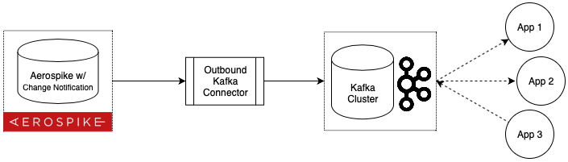

# Aerospike and Kafka
Using Aerospike with Kafka - outbound from Aerospike




## Companion Code
This exeammple uses Docker and Docker Compose to create the environment to track users visits to a website, as log level data, then export it to a Kafka topic for downstream aggregation, transformation and analysis.

Docker containers
- Zookeeper
- Kafka
- Aerospike Enterprise Edition
- [Aerospike COnnector for Kafka](https://www.aerospike.com/docs/connectors/enterprise/kafka/)
There is a traffice sumulator, written in Java, to simulate tracking of users visites to a web site (Site Tracking)

Clone the repository using:
```bash
https://github.com/helipilot50/aerospike-and-kafka.git
```

## Build Docker images
```bash
sudo docker-compose build
sudo docker-compose up
```
# Run the example
```bash
sudo docker-compose up
```
